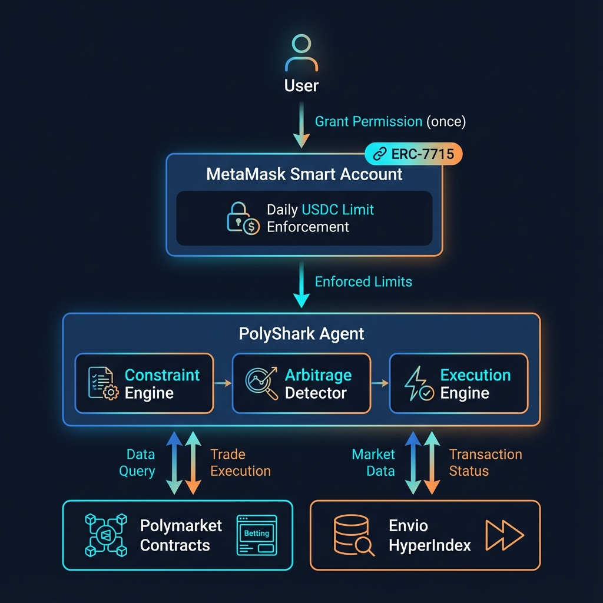

# 🦈 PolyShark

> *"If markets contradict themselves, eat the contradiction."*

<p align="center">
  
</p>

**Permission-safe arbitrage agent** for Polymarket using **ERC-7715 Advanced Permissions** + **Envio HyperIndex**.

[](https://eips.ethereum.org/EIPS/eip-7715)
[](https://docs.envio.dev/)
[](https://www.rust-lang.org/)
[](https://polygon.technology/)

---

## ⚡ The Problem → Solution

| Traditional Bots | PolyShark + ERC-7715 |
|------------------|----------------------|
| ❌ Popup every trade | ✅ **One popup, then autonomous** |
| ❌ Trust-based limits | ✅ **Cryptographic enforcement** |
| ❌ Unlimited risk | ✅ **$10/day max, instant revoke** |
| ❌ No data freshness | ✅ **Halts on stale data** |

> 💡 This is the **last popup** you'll see for the next thousand trades.

---

## 🎯 How It Works

```
USER → Grant Permission (once)
        ↓
MetaMask Smart Account (ERC-7715) → Enforced Daily Limit
        ↓
PolyShark Agent (Rust)
├── Constraint Engine    → YES + NO = 1 violations
├── Arbitrage Detector   → Expected profit calculation
└── Execution Engine     → Permission-validated trades
        ↓                       ↑
Polymarket Contracts ←── Envio HyperIndex (~150ms)
```

**5 Steps:** Detect mispricing → Validate allowance → Execute trade → Adapt strategy → Halt if stale

---

## 🛡️ Safety by Design

| Layer | Protection |
|-------|------------|
| **ERC-7715** | Cryptographic daily limits, instant revocation |
| **Envio** | ~150ms latency, auto-halt if >5s stale |
| **Strategy** | Aggressive→Normal→Conservative based on budget |
| **Failures** | 3 strikes → Safe mode (5 min cooldown) |

```toml
# config.toml
[safety]
max_data_delay_ms = 5000
max_consecutive_failures = 3
```

---

## 🏗️ Architecture

<p align="center">
  
</p>

```
src/
├── metamask.rs    → ERC-7715 client, strategy modes
├── wallet.rs      → Permission-aware execution
├── market.rs      → Envio data consumer
├── constraint.rs  → Logical arbitrage (YES+NO=1)
├── arb.rs         → Profit calculation
├── execution.rs   → Trade engine (fees, slippage, fills)
└── engine.rs      → Main loop + safety halt
```

---

## 📊 Permission Spec

```json
{
  "erc7715:permission": {
    "type": "spend",
    "token": { "symbol": "USDC", "address": "0x2791Bca1f2..." },
    "limit": { "amount": 10.0, "period": "day" },
    "duration": { "days": 30 },
    "scope": { "protocol": "polymarket" }
  }
}
```

| Property | Value |
|----------|-------|
| Token | USDC (Polygon) |
| Limit | 10 USDC/day (configurable 5-50) |
| Duration | 30 days |
| Revocation | Instant, one-click |

---

## 🛠️ Tech Stack

| Component | Tech |
|-----------|------|
| Agent | Rust (async, high-perf) |
| Wallet | MetaMask Smart Account |
| Permissions | ERC-7715 |
| Data | Envio HyperIndex |
| Chain | Polygon (137) |
| UI | HTML/CSS/JS Dashboard |

---

## 🚀 Quick Start

```bash
git clone https://github.com/dinxsh/polyshark
cp .env.example .env
cargo build --release && cargo run
```

Open `dashboard/index.html` → Connect MetaMask → Grant permission → Watch autonomous trading.

---

## 📈 Strategy Modes

| Mode | Budget | Min Edge |
|------|--------|----------|
| 🟢 Aggressive | >70% left | ≥1% |
| 🟡 Normal | 30-70% | ≥2% |
| 🔴 Conservative | <30% | ≥5% |

---

## 🔧 Use as Template

PolyShark = **reference implementation** for ERC-7715 agents.

**Swap layers:**
- `market.rs` → Your data source (Uniswap, OpenSea, etc.)
- `constraint.rs` → Your domain logic (DEX routes, NFT bids)
- Keep permission layer unchanged

> See [`examples/gator-bridge.ts`](./examples/gator-bridge.ts) for TypeScript example.

---

## 📚 Docs

| Doc | Purpose |
|-----|---------|
| [metamask/v1.md](./docs/metamask/v1.md) | ERC-7715 Architecture |
| [spec.md](./docs/spec.md) | Technical Spec |
| [demo-script.md](./docs/demo-script.md) | Demo Walkthrough |
| [HACKQUEST_SUBMISSION.md](./docs/HACKQUEST_SUBMISSION.md) | Hackathon Submission |

---

## 🔗 Resources

[Delegation Toolkit](https://docs.metamask.io/smart-accounts/delegation-toolkit) • [Smart Accounts](https://docs.metamask.io/smart-accounts) • [ERC-7715](https://eips.ethereum.org/EIPS/eip-7715) • [create-gator-app](https://github.com/MetaMask/create-gator-app) • [Envio](https://docs.envio.dev/)

---

<p align="center">
  <b>MIT License</b> • Built for MetaMask x Envio Hackathon
</p>
